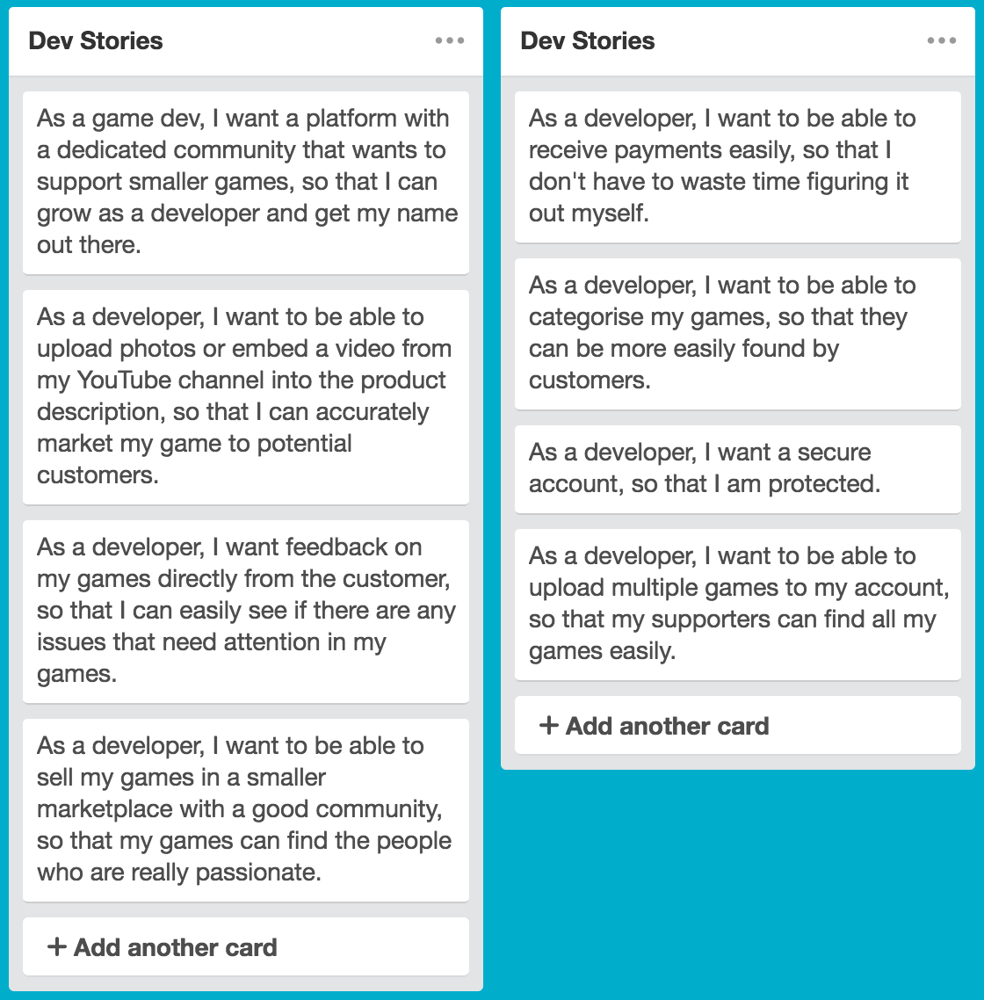
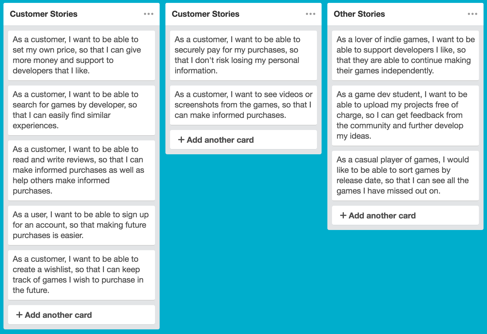

# flrish
##### Flourish (verb)
  1. Grow or develop in a healthy or vigorous way, especially as the result of a particularly congenial environment.
  2. Develop rapidly and successfully.

**Flrish** is a marketplace for indie game developers to upload and sell their games to a passionate community of fans. 

It is designed to be a place where developers and customers can both have the best experience when it comes to buying and selling video games.

It is a community of like-minded, and passionate people to come together. For developers, it is a place where they can get a foot in the door and start selling their work. For customers, it is a place where they can support the things they love and help developers to grow.

---

## The Problem

There are so many ways for aspiring developers or indie developers to sell their games these days, however, it is also harder than ever to get your games noticed. Other markets are flooded with too many games, and don't have a community that promotes innovation, development and growth of video games as a medium. 

## The Solution

A marketplace-community that is solely for indie developers or aspiring developers to showcase and sell thier games to a passionate community. The website will allow users to easily find games they will love and allow developers and their games to **flourish**.

---

## User Stories

## Detailed User Stories

*Developers should be able to set a minimum price.*

**Feature:** Set a minimum price

* As a developer
* I want to set a minimum price
* So customers can choose to give more if they want

**Scenario:** Developer uploads game

* Given that I am a logged in Developer
* When I upload a game to sell
* I should have the option to set a minimum price for the game

---

*Customers should be able to set their own price*

**Feature:** Flexible pricing.

* As a customer
* I want to be able to pay more than the price set by the developer
* So that I can show my support for developers and games I really like

**Scenario:** Customer goes to checkout with a game

* Given that I am a logged in customer
* When I go to purchase a game at checkout
* I should be asked how much I would like to pay
* I should be able to type in a number higher than the listed price
* And the transaction should charge me the amount I specified

---

*story goes here*

**Feature:** 

* 

**Scenario:** 

* 

---

*story goes here*

**Feature:** 

* 

**Scenario:** 

* 

---

*story goes here*

**Feature:** 

* 

**Scenario:** 

* 

---